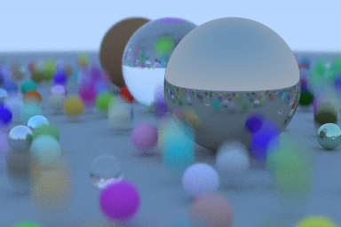
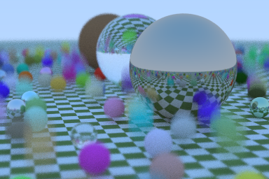
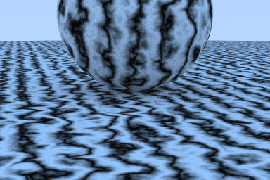
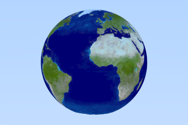
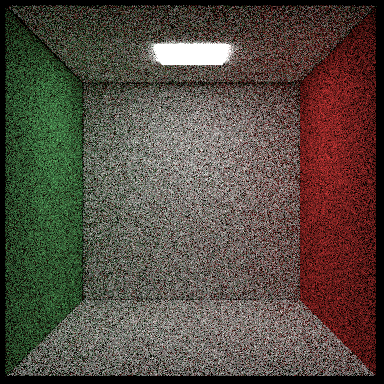
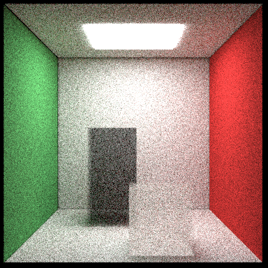
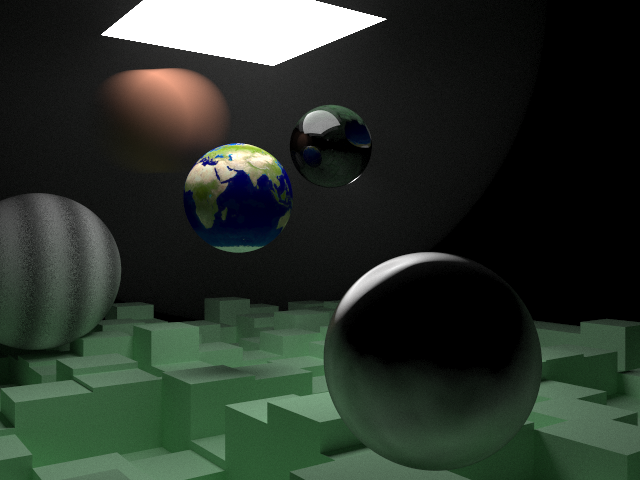

<a href="https://github.com/moddyz/RayTracingTheNextWeek/actions?query=workflow%3A%22Build+and+test%22"></a>

# RayTracingTheNextWeek

An implementation of the book [Ray Tracing: The Next Week](https://raytracing.github.io/books/RayTracingTheNextWeek.html).  

## Table of Contents

- [Dependencies](#dependencies)
- [Prequel](#prequel)
- [Programs](#programs)
  * [0. Motion Blur](#0-motion-blur)
  * [1. Bounding Volume Hierarchies](#1-bounding-volume-hierarchies)
  * [2. Solid Textures](#2-solid-textures)
  * [3. Perlin Noise](#3-perlin-noise)
  * [4. Image Texture Mapping](#4-image-texture-mapping)
  * [5. Rectangles and Lights](#5-rectangles-and-lights)
  * [6. Volumes](#6-volumes)
  * [7. A Scene Testing All New Features](#7-a-scene-testing-all-new-features)
- [Sequel](#sequel)
- [Building](#building)

### Dependencies

The following dependencies are mandatory:
- C++ compiler
- [CMake](https://cmake.org/documentation/) (3.12 or greater)

## Building

Example snippet for building this project:
```
mkdir build && cd build
cmake -DCMAKE_INSTALL_PREFIX="/apps/CXXTemplate/" ..
cmake --build  . -- VERBOSE=1 -j8 all install
```

## Prequel

The implementation to the prequel at [RayTracingInOneWeekend](https://github.com/moddyz/RayTracingInOneWeekend).

## Programs

### 0. Motion Blur



Simulate the effect of motion blur, by introducing the concept of time to rays and scene objects.

Rays are fired at random times between *shutter open* and *close* to produce the averaged image across that time interval.

Scene objects now possess *attributes*.  Attributes store values for multiple time samples, and supports 
queries between, or beyond available samples.  For more information, see the [class documentation for Attribute](https://moddyz.github.io/RayTracingTheNextWeek/classAttribute.html).

[Source code](./src/0_motionBlur/main.cpp)

[Link to Chapter 2](https://raytracing.github.io/books/RayTracingTheNextWeek.html#motionblur)

### 1. Bounding Volume Hierarchies


Introducing bounding volume hierarchy (BVH) to accelerate the ray tracing.  The BVH reduces the number of
intersection tests performed per-ray by pruning out hierarchies of scene objects whose bounding volume does not 
intersect with the ray.

With the same scene from [0. Motion Blur](#0-motion-blur):
- With BVH: **10.575s**
- Without BVH: **216.854s**

Measurements taken using the `time` Linux command line utility, on a Thinkpad X1 Extreme outfitted 
with Intel(R) Core(TM) i7-9750H CPU @ 2.60GHz.

[Source code](./src/1_boundingVolumeHierarchies/main.cpp)

[Link to Chapter 3](https://raytracing.github.io/books/RayTracingTheNextWeek.html#boundingvolumehierarchies)

### 2. Solid Textures



Introducing textures to sample colors from.  Textures are available as a type of material parameter, such
as the "albedo" parameter for Lambert.

In the image above, the ground plane is assigned a Lambert material with a CheckerTexture for its albedo parameter.

[Source code](./src/2_solidTextures/main.cpp)

[Link to Chapter 4](https://raytracing.github.io/books/RayTracingTheNextWeek.html#solidtextures)

### 3. Perlin Noise



Introduced a Perlin noise generator, for producing smooth noise.  

By accumulating multiple layers of perlin noise applied to a sine function over the Z-coordinate, a marble-like texture is generated.

[Source code](./src/3_perlinNoise/main.cpp)

[Link to Chapter 5](https://raytracing.github.io/books/RayTracingTheNextWeek.html#perlinnoise)

### 4. Image Texture Mapping



Introduced image based textures, which can be loaded from a file on disk.

During color sampling, the geometric surface coordinates (uv) are mapped to a particular image pixel coordinate.

[Source code](./src/4_imageTextureMapping/main.cpp)

[Link to Chapter 6](https://raytracing.github.io/books/RayTracingTheNextWeek.html#imagetexturemapping)

### 5. Rectangles and Lights



Introducing emissive materials to provide local lighting to the scene, and a new Box scene object class.

[Source code](./src/5_rectanglesAndLights/main.cpp)

[Link to Chapter 7](https://raytracing.github.io/books/RayTracingTheNextWeek.html#rectanglesandlights)

### 6. Volumes



Adding a ConstantMedium for a volume of particulates.  

The ConstantMedium is associated with a geometric shape, and models ray hitting particles via a probability based on distance that the ray travels through the volume.  

Any particle hit will cause the ray to be scattered in a random direction thanks to the new Isotropic material.

[Source code](./src/6_volumes/main.cpp)

[Link to Chapter 9](https://raytracing.github.io/books/RayTracingTheNextWeek.html#volumes)

### 7. A Scene Testing All New Features



The final render, testing all the new features learned in [Ray Tracing: The Next Week](https://raytracing.github.io/books/RayTracingTheNextWeek.html).

Rendered with 15,000 samples per pixel.

[Source code](./src/7_aSceneTestingAllNewFeatures/main.cpp)

[Link to Chapter 10](https://raytracing.github.io/books/RayTracingTheNextWeek.html#ascenetestingallnewfeatures)

## Sequel

The implementation of the sequel is available under [RayTracingTheRestOfYourLife](https://github.com/moddyz/RayTracingTheRestOfYourLife).
